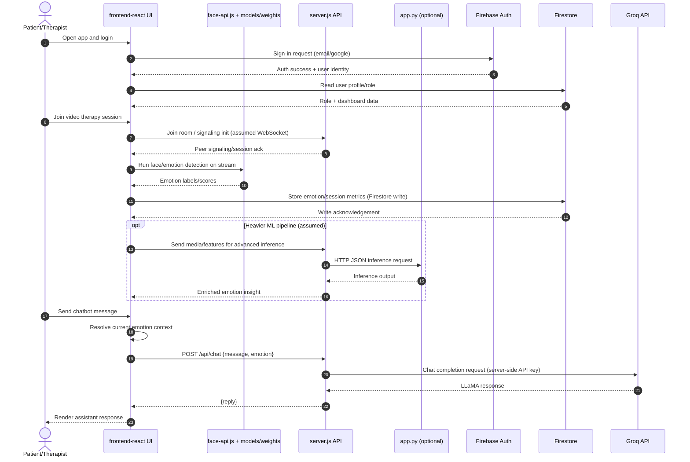

Assumptions
- frontend-react is the primary web client served separately in development and integrated with server.js APIs in runtime.
- Video signaling is handled through server.js over WebSocket or Socket.IO (assumed from telehealth/video-call architecture).
- face-api.js and models/weights are used for browser-side face and expression inference where possible.
- app.py is used as a Python ML service for heavier inference or ML workflows when invoked by server.js or scripts.
- Firebase Auth and Firestore are external managed services used for identity and application data.
- Groq API is called only from server.js using server-side secret LLAMA_API_KEY.

```mermaid
flowchart LR
  subgraph A[Browser / Client Boundary]
    U[Patient or Therapist]
    FE[frontend-react\nReact + Vite UI]
    FA[face-api.js + models/weights\nEmotion inference]
    U --> FE
    FE --> FA
  end

  subgraph B[Backend / Server Boundary]
    API[server.js\nNode.js + Express API]
    PY[app.py\nPython ML service]
    API <-->|HTTP JSON\nML request/response| PY
  end

  subgraph C[Third-Party Cloud Boundary]
    FAuth[Firebase Auth]
    FS[(Firestore)]
    G[Groq API\nllama3-8b-8192]
  end

  FE <-->|HTTPS JSON\n/api/*| API
  FE <-->|Firebase SDK\nAuth flow| FAuth
  FE <-->|Firestore read/write\n(assumed direct SDK in some screens)| FS
  API <-->|Firebase Admin/SDK\nuser/session/report persistence| FS
  API -->|Bearer token + prompt\n/api/chat| G
  G -->|LLM completion| API
  API -->|HTTPS JSON reply| FE
  FE <-->|WebSocket signaling\n(assumed for video room)| API
```

```mermaid
flowchart TB
  subgraph A[Browser / Client Boundary]
    App[frontend-react/src/App.jsx\nRouting + auth guards]
    Pages[pages/*\nLanding/Login/Patient/Therapist\nDashboard/Reports/VideoCall]
    ChatUI[components/Chatbot.jsx]
    EmotionUI[Video and Emotion UI\nface-api.js integration]
    LocalModels[public/models + root models/weights]

    App --> Pages
    Pages --> ChatUI
    Pages --> EmotionUI
    EmotionUI -->|model load/inference| LocalModels
  end

  subgraph B[Backend / Server Boundary]
    Express[server.js\nREST endpoints + chat handler]
    ChatRoute[POST /api/chat]
    SessionRoutes[Session/Report/Booking APIs\n(assumed from project guides)]
    Signal[Socket/WebRTC signaling\n(assumed)]
    PyBridge[app.py bridge\noptional ML processing]

    Express --> ChatRoute
    Express --> SessionRoutes
    Express --> Signal
    Express --> PyBridge
  end

  subgraph C[Third-Party Cloud Boundary]
    FirebaseAuth[Firebase Auth]
    Firestore[(Firestore DB)]
    Groq[Groq Chat Completions API]
  end

  App <-->|auth state| FirebaseAuth
  Pages <-->|CRUD data| Firestore
  Express <-->|admin/service writes + reads| Firestore
  ChatUI -->|HTTPS JSON\nmessage + emotion| ChatRoute
  ChatRoute -->|system prompt + user prompt| Groq
  Groq -->|assistant reply| ChatRoute
  ChatRoute -->|reply JSON| ChatUI
  EmotionUI -->|emotion context\n(assumed stored in session/local storage)| ChatUI
```

